# f068_feiyi
vue+flask山西非遗文化遗产图谱可视化系统

> > 学长的微信：mmdsj186011  【开发不易、源码有偿、谢谢理解】


编号：F068
项目介绍：

```python
本系统主要实现了以下功能：
非遗项目知识图谱可视化
非遗项目可视化+关键词分析
非遗项目新闻咨询+点赞+评论
非遗项目检索
非权限+普通用户+管理员
用户管理、非遗新闻管理、项目管理
```
非遗项目文档说明：
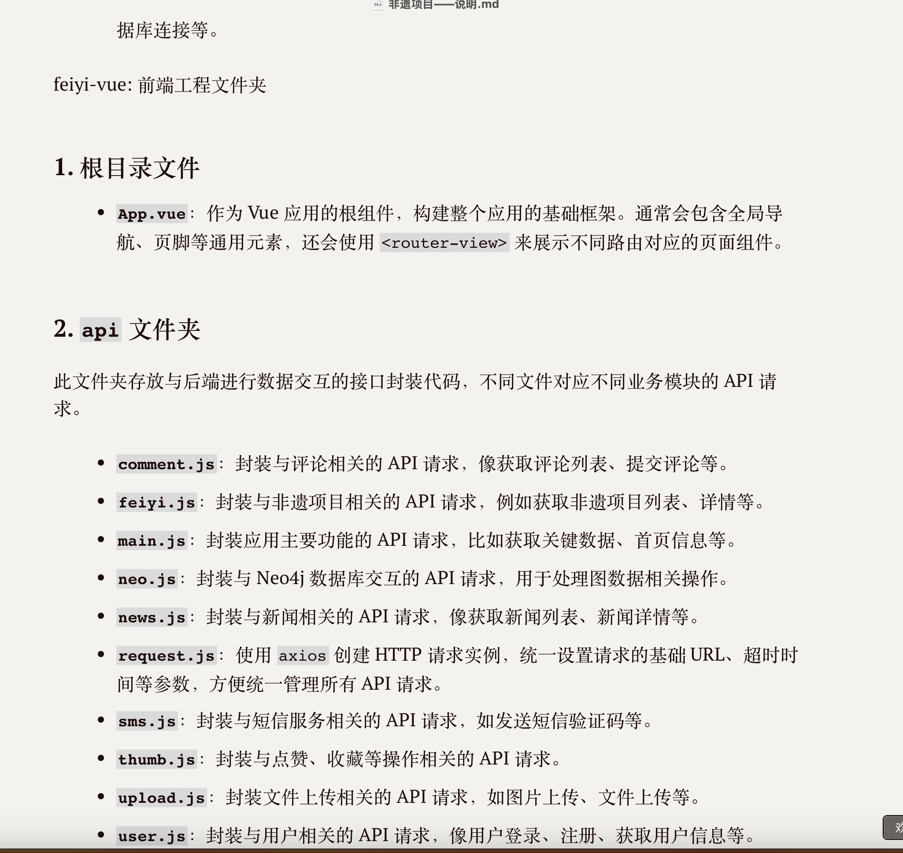

## 功能模块
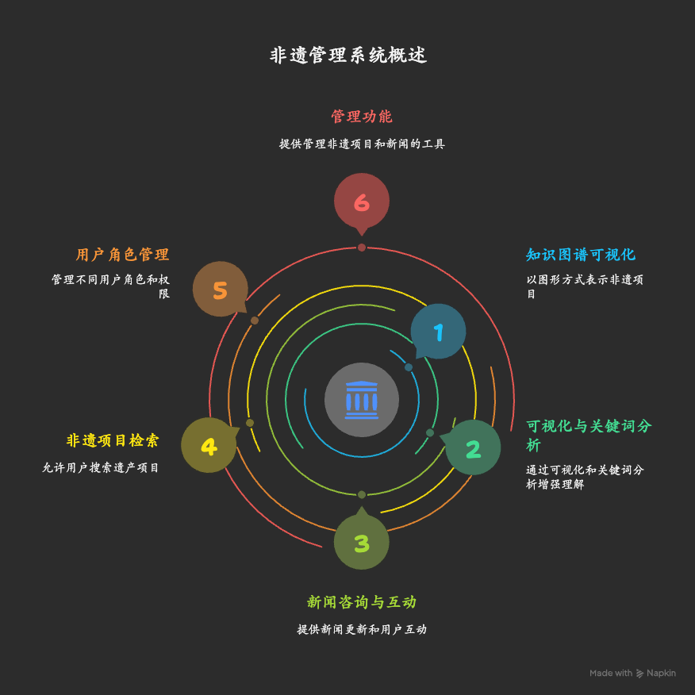
### **1. 用户相关功能**

- **登录与注册**：通过 `api/userApi.py` 中的 `login` 函数实现用户登录功能，`models/model.py` 中的 `valid_register` 函数可用于用户注册校验，不过代码未展示完整注册接口。
- **权限管理**：规划区分普通用户和管理员，不同角色登录后查看不同菜单，但代码里未完整呈现权限控制逻辑。
- **用户信息管理**：
    - `api/userApi.py` 中的 `userinfo` 函数可根据用户名查询用户信息。
    - `idconfirm` 函数可更新用户身份证号和真实姓名。
    - `modifypass` 函数支持用户修改密码。


### **2. 非遗项目相关功能**

- **数据导入与管理**：`data/导入非遗数据mysql.py` 能将 Excel 文件中的非遗数据导入 MySQL 数据库，并更新非遗项目描述信息。
- **知识图谱功能**：
    - `data/构建知识图谱.py` 从 MySQL 读取数据，在 Neo4j 中构建知识图谱。
    - `api/feiyiApi.py` 中的 `getFY_KnowledgeGraph` 函数可根据参数查询知识图谱信息。
- **搜索与查询**：
    - `api/mainApi.py` 的 `get` 函数支持根据关键词模糊搜索非遗项目。
    - `api/feiyiApi.py` 实现了非遗项目的分页查询、单个查询、全部查询等功能。
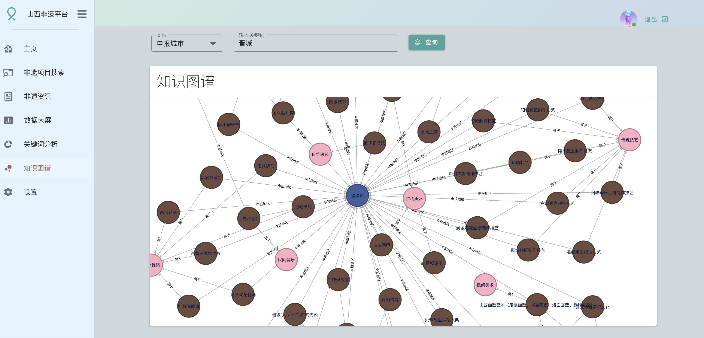
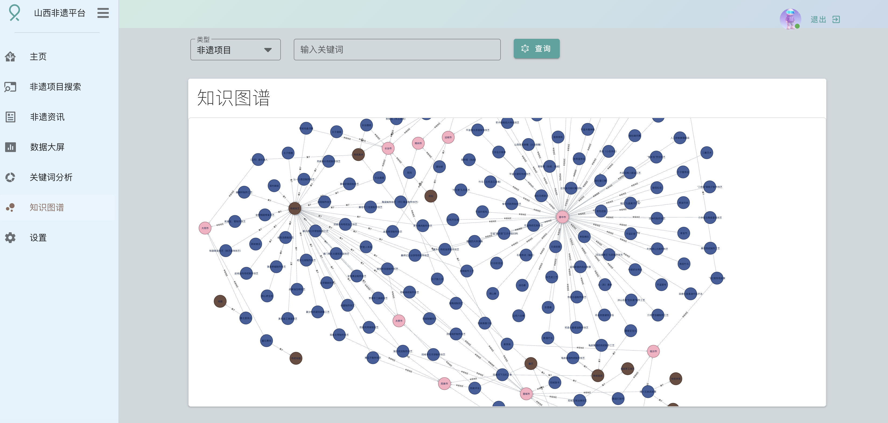
非遗项目的查询：
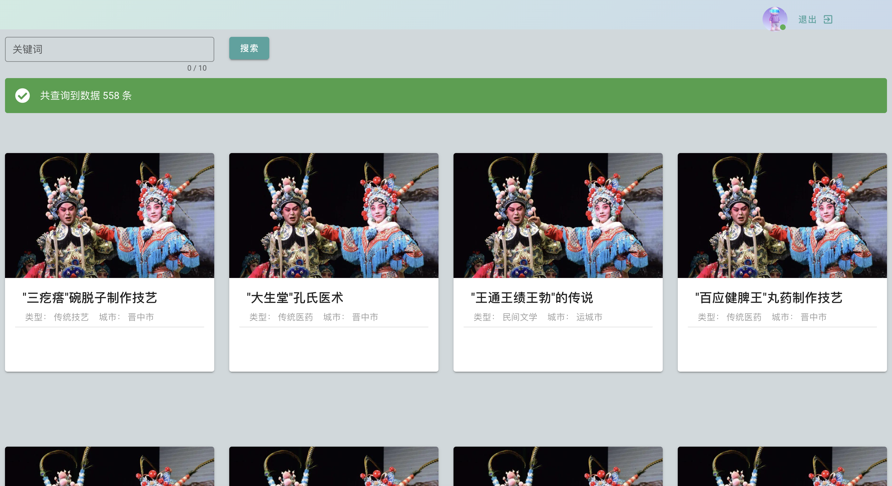

### **3. 新闻资讯相关功能**

`api/newsApi.py` 实现新闻资讯相关接口，支持新闻的分页查询、单个查询、全部查询、新增、更新和删除操作。
新闻还支持点赞和讨论
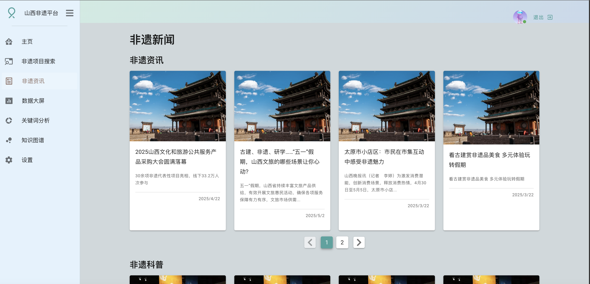
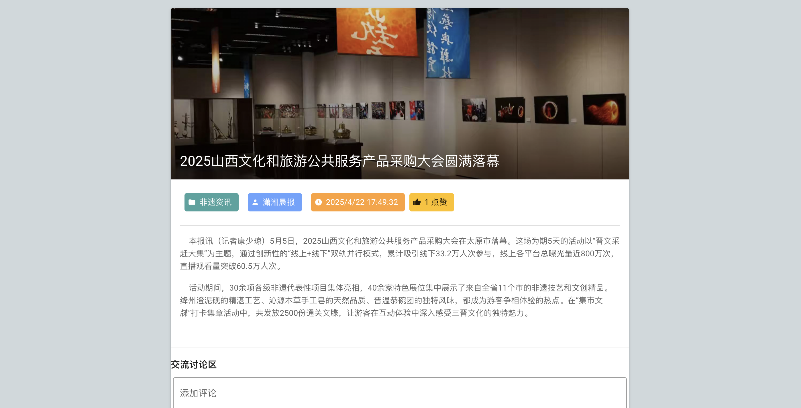
讨论区功能
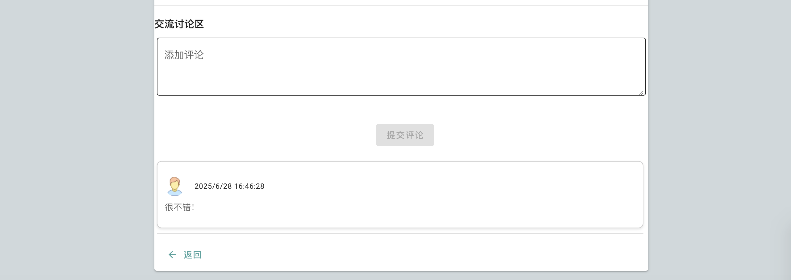

### **4. 评论与点赞功能**

- **评论**：`api/commentApi.py` 处理评论相关接口，支持评论的分页查询、单个查询、新增、更新和删除操作。
- **点赞**：`api/thumbApi.py` 处理点赞相关接口，支持点赞信息的分页查询、单个查询、新增、更新和删除操作。

### **5. 数据可视化与分析功能**

- **关键词分析**：`api/mainApi.py` 的 `getKeywords` 函数使用 TF - IDF 和 TextRank 算法提取关键词并返回。
- **词云生成**：`models/feiyi.py` 中的 `getWords` 函数可生成词云数据。
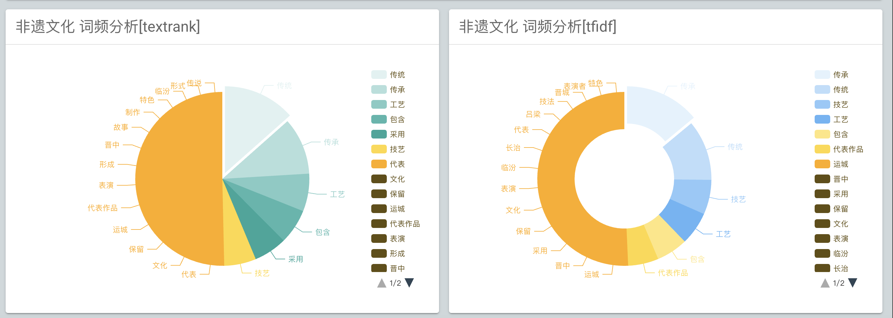

### **6. 主页非遗地图**

`readme.md` 提到主页有非遗地图，数据来源于阿里云 DataV 官方，点击可查看知识图谱。

点击查看具体的城市，比如忻州市
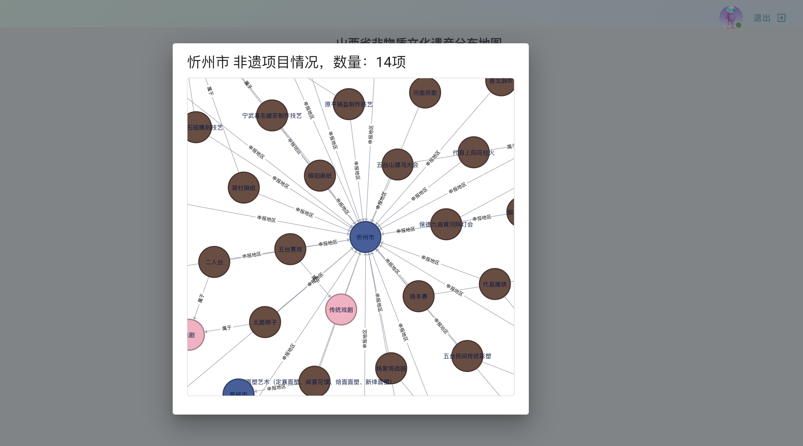
切换到吕梁市：
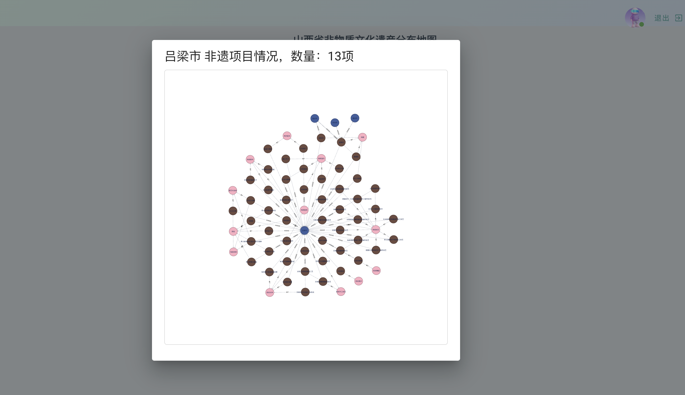

### **7. 管理员功能**
这个系统具备全套管理员功能，可以管理非遗项目、用户，简单来说就是增删改查
管理员主页：
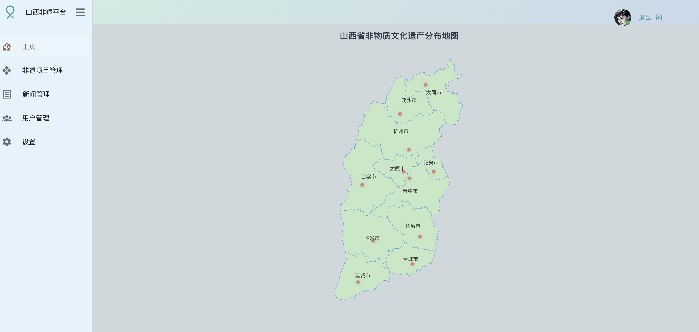
非遗项目管理
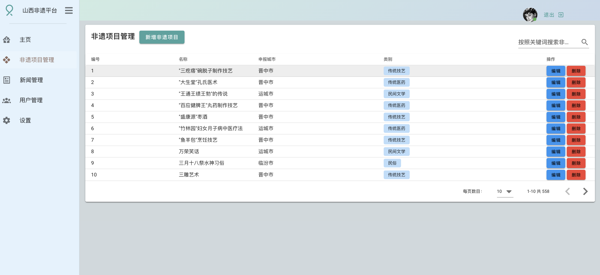

新闻管理


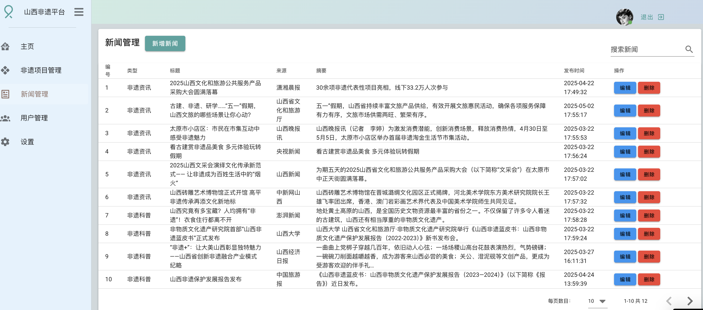


用户管理
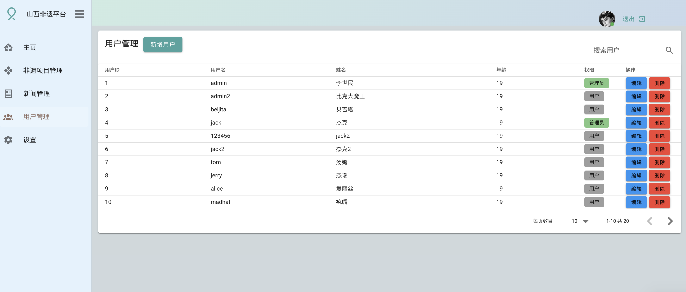

### 数据表

```bash
-- 创建非物质文化遗产信息表
CREATE TABLE `tb_feiyi` (
  `id` INT NOT NULL AUTO_INCREMENT COMMENT '序号(自增主键)',
  `name` VARCHAR(100) NOT NULL COMMENT '非遗名称',
  `region` VARCHAR(50) NOT NULL COMMENT '所属地区(地级市)',
  `category` VARCHAR(50) NOT NULL COMMENT '非遗类型',
  `description` TEXT NOT NULL COMMENT '详细介绍',
  PRIMARY KEY (`id`)
) ENGINE=InnoDB DEFAULT CHARSET=utf8mb3 COMMENT='非物质文化遗产信息表';
```

### 知识图谱构建

完成了下面是进行知识图谱的构建， 直接读取tb_feiyi表，然后根据name、region、category字段来进行知识图谱构建，分别对应neo4j节点是 名称非遗项目、 城市、 类型， 其中城市和类型都可能有多个，用、分隔，考虑到不想让节点重复，应该用merge语句，使用py2neo操作neo4j数据库， 其中非遗项目 分别和城市、类型有关系，也需要建立。
原始数据
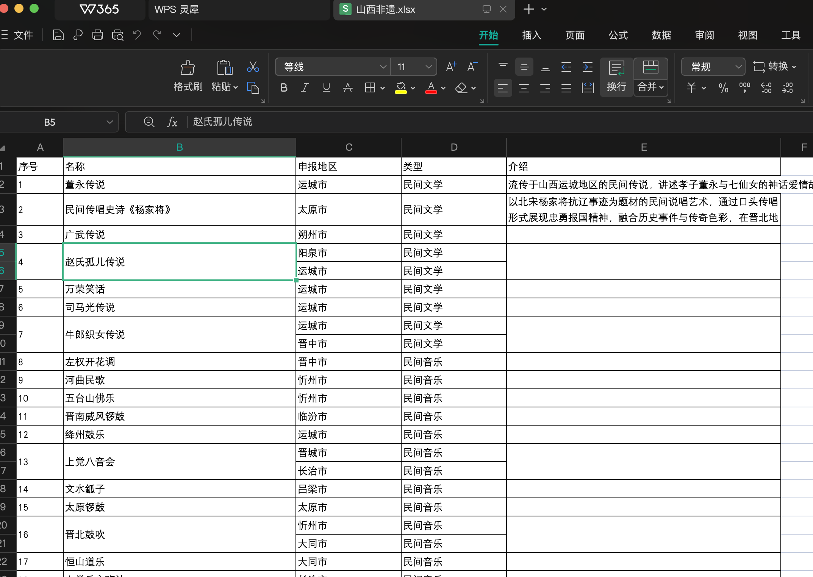

